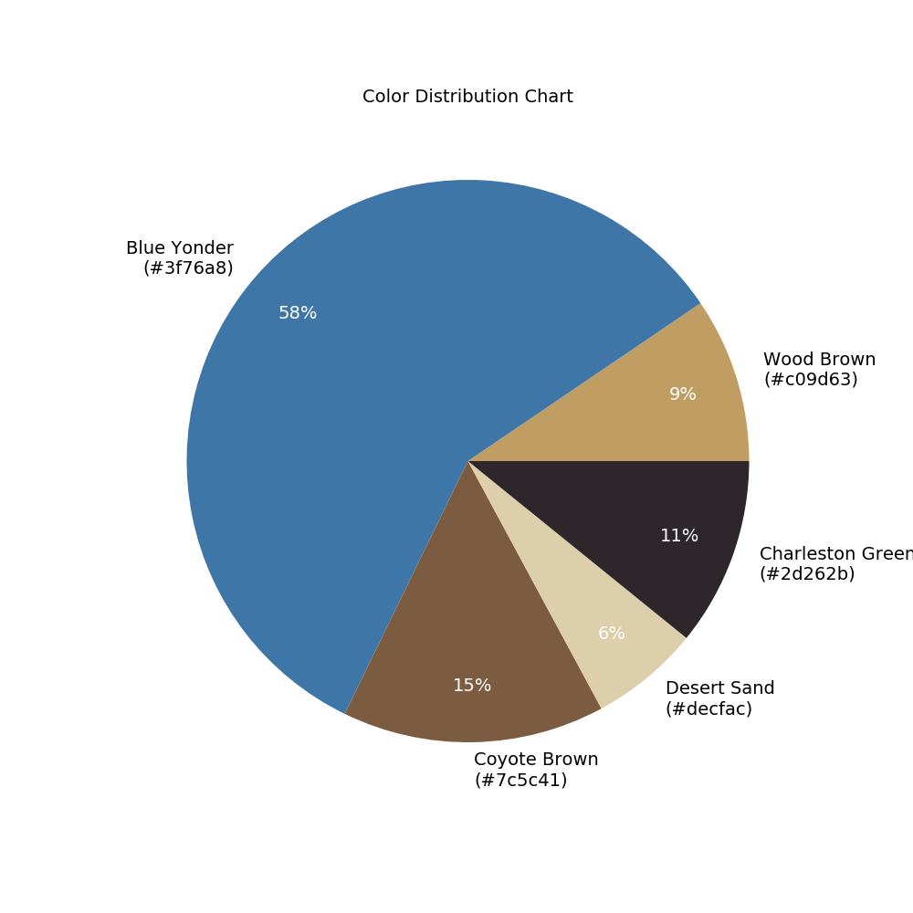

# Cartoonisation
Python project to cartoonise images.

##### Usage:
Clone the repository, and run the python file `cartoonisation.py` using python 3, with the following optional flags. Example:
```sh
python3 cartoonisation.py --path 'images/1.png' --num_colors 3 --width 1200 --height 800
```
You can replace the path string as required. 
Example images have been provided in the `images` folder. The results will be saved in the enclosing folder.

##### Example:
Input Image:


Color Distribution (5 colors):


Output Image (5 colors):


